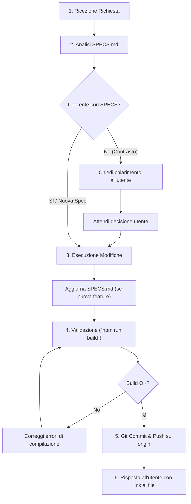

# Linee Guida Operative per Agenti AI (AGENTS.md)

> **Documento vincolante per sistemi di harness, agenti autonomi e assistenti AI di programmazione.**  
> Qualsiasi agente AI che opera su questa codebase deve attenersi tassativamente alle regole descritte di seguito prima, durante e dopo ogni intervento sul repository.

---

## 1. Regole Primarie Obbligatorie

### 1.1. Obbligo di Git Commit e Push su `origin`
- **Ogni volta che vengono apportate modifiche al codice o alla documentazione**, l'agente deve:
  1. Verificare preventivamente l'integrità del progetto eseguendo il comando di build (`npm run build`).
  2. Aggiungere le modifiche all'area di stage (`git add .` o specificando i file modificati).
  3. Creare un commit con messaggio descrittivo aderente allo standard **Conventional Commits**:
     - `feat: ...` per nuove funzionalità.
     - `fix: ...` per correzioni di bug.
     - `refactor: ...` per refactoring di codice senza cambi di comportamento.
     - `docs: ...` per modifiche alla documentazione (inclusi `SPECS.md` e `AGENTS.md`).
     - `perf: ...` per ottimizzazioni di performance.
     - `chore: ...` per aggiornamenti di build, configurazione o dipendenze.
  4. Eseguire immediatamente il push verso il remote `origin` sul branch di lavoro corrente:
     ```bash
     git push origin <branch>
     ```
  5. Se il push fallisce (ad esempio per conflitti remoti o problemi di autorizzazione), l'agente deve analizzare il messaggio di errore, tentare una risoluzione sicura (`git pull --rebase origin <branch>` se appropriato) o notificare con precisione l'utente.

---

### 1.2. Consultazione Obbligatoria e Allineamento con `SPECS.md`
- **Prima di avviare qualsiasi modifica**, l'agente deve consultare attentamente il file [`SPECS.md`](file:///c:/Users/Luca/git/lscway/SPECS.md) per verificare la coerenza con l'architettura, le regole di business e il dominio applicativo.
- **Gestione dei casi:**
  - **Caso A (Modifica o Feature non presente nelle SPECS):**  
    Se la modifica richiesta è nuova, lecita e coerente con la filosofia del progetto ma non ancora documentata, l'agente deve **integrare e aggiornare `SPECS.md`** all'interno dello stesso ciclo di lavoro, descrivendo il nuovo comportamento, i nuovi endpoint o i nuovi componenti.
  - **Caso B (Modifica in contrasto con le SPECS esistenti):**  
    Se la richiesta dell'utente contrasta apertamente con le specifiche definite (es. rimozione del base path, introduzione di SSR non compatibile, alterazione della logica docenti/studenti, violazione del funzionamento offline):  
    🛑 **L'agente NON deve procedere alla cieca.**  
    Deve fermarsi e chiedere conferma esplicita all'utente, ponendo l'alternativa:
    1. *Aderire alle attuali `SPECS.md`* proponendo una soluzione alternativa conforme.
    2. *Aggiornare le `SPECS.md`* accogliendo il nuovo requisito come modifica deliberata delle specifiche del progetto.

---

## 2. Invarianti Tecniche del Progetto

Qualsiasi intervento sul codice deve preservare i seguenti pilastri architetturali:

### 2.1. Base Path Dinamico (`/app/way/tmp`)
- L'applicazione viene servita sotto il path `/app/way/tmp` (`paths.base` in `svelte.config.js`).
- **VIETATO** inserire link, reindirizzamenti o riferimenti ad asset con percorsi assoluti hardcoded dalla radice del dominio (es. non usare mai `/docente`, `/favicon.png`, `/logo-blue.webp`).
- **OBBLIGATORIO** importare ed usare `base` da `$app/paths` (es. `${base}/docente`, `${base}/logo-blue.webp`) o utilizzare percorsi relativi corretti.

### 2.2. Single Page Application (SPA) Pura - Nessun SSR
- L'app è una SPA statica compilata con `@sveltejs/adapter-static` (`ssr: false`, `prerender: false`).
- Non devono essere introdotte dipendenze native di Node.js (`fs`, `path`, `crypto`, ecc.) all'interno di `src/`.
- Tutti gli accessi a oggetti globali del browser (`window`, `document`, `navigator`, `localStorage`, `caches`) devono essere eseguiti dentro `onMount()` oppure racchiusi in guardie `if (typeof window !== 'undefined')`.

### 2.3. Integrità PWA, Service Worker e Caching
- Il Service Worker (`static/service-worker.js`) sfrutta Workbox per strategie `CacheFirst` sui file immutabili di SvelteKit (`/_app/immutable/`) e `StaleWhileRevalidate` per asset statici e shell di navigazione.
- Se vengono aggiunti o rinominati asset statici critici, verificare l'impatto sul Service Worker e, se necessario, allineare la costante `CACHE_VERSION` in `static/service-worker.js` e `APP_VERSION` in `src/app.html`.
- Non rimuovere la logica di caching offline né la sincronizzazione delle sostituzioni in background.

### 2.4. Mobile First, Gestione Viewport e Scaler Font
- L'app è impiegata in massima parte da smartphone.
- Il componente `ItemSelect.svelte` gestisce l'apertura su mobile e l'adattamento dinamico all'altezza della tastiera virtuale tramite `window.visualViewport`. Questa logica non deve essere manomessa o degradata.
- La proprietà CSS `--table-font-scale` (pilotata dallo store `tableFontScale`) deve essere rispettata da tutte le tabelle orario.
- Mantenere la compatibilità sia in tema chiaro che in tema scuro (`data-theme="light"` / `data-theme="dark"`).

### 2.5. Riservatezza e Logica di Dominio
- Riconoscimento docenti basato sulla regola di dominio: email `@lscortese.com` senza punto nella parte locale dell'username.
- Le fasce orarie sono 8 (da `08:00` a `14:25`).
- Le materie speciali (`POT`, `RIC`, `INC`, `MADISO`) devono mantenere le rispettive regole di visualizzazione e di ordinamento in tabella.

---

## 3. Workflow Standard dell'Agente per Ogni Task

Per garantire la massima affidabilità con qualsiasi sistema di harness o pipeline autonoma, l'agente deve seguire questo ciclo di esecuzione a 6 fasi:



### Dettaglio delle Fasi:
1. **Analisi e Ispezione:** leggere i requisiti dell'utente ed esaminare il codice impattato insieme a [`SPECS.md`](file:///c:/Users/Luca/git/lscway/SPECS.md).
2. **Risoluzione delle Discrepanze:** se c'è un conflitto con le specifiche, formulare la domanda all'utente prima di applicare modifiche distruttive o incoerenti.
3. **Modifica Chirurgica:** scrivere codice pulito, modulare e leggibile, preservando i commenti esistenti. Se vengono aggiunte nuove funzionalità, aggiornare contestualmente `SPECS.md`.
4. **Verifica Locale:** eseguire sempre:
   ```bash
   npm run build
   ```
   e accertarsi che termini con `exit code 0` senza errori o warning critici.
5. **Versionamento e Distribuzione:**
   ```bash
   git add <file-modificati>
   git commit -m "<tipo>: <descrizione sintetica>"
   git push origin <branch>
   ```
6. **Riepilogo:** fornire all'utente un resoconto chiaro e sintetico con collegamenti cliccabili ai file modificati nel formato Markdown `[nome_file](file:///percorso/assoluto)`.

---

## 4. Linee Guida di Comunicazione
- Rispondere in modo conciso, professionale e orientato alla soluzione.
- Non duplicare interi blocchi di documentazione nelle risposte se sono già presenti in `SPECS.md` o `AGENTS.md`: puntare l'utente al file pertinente.
- Quando si propongono scelte architetturali, evidenziare pro, contro e impatto sull'esperienza offline o sul bundle dell'applicazione.
